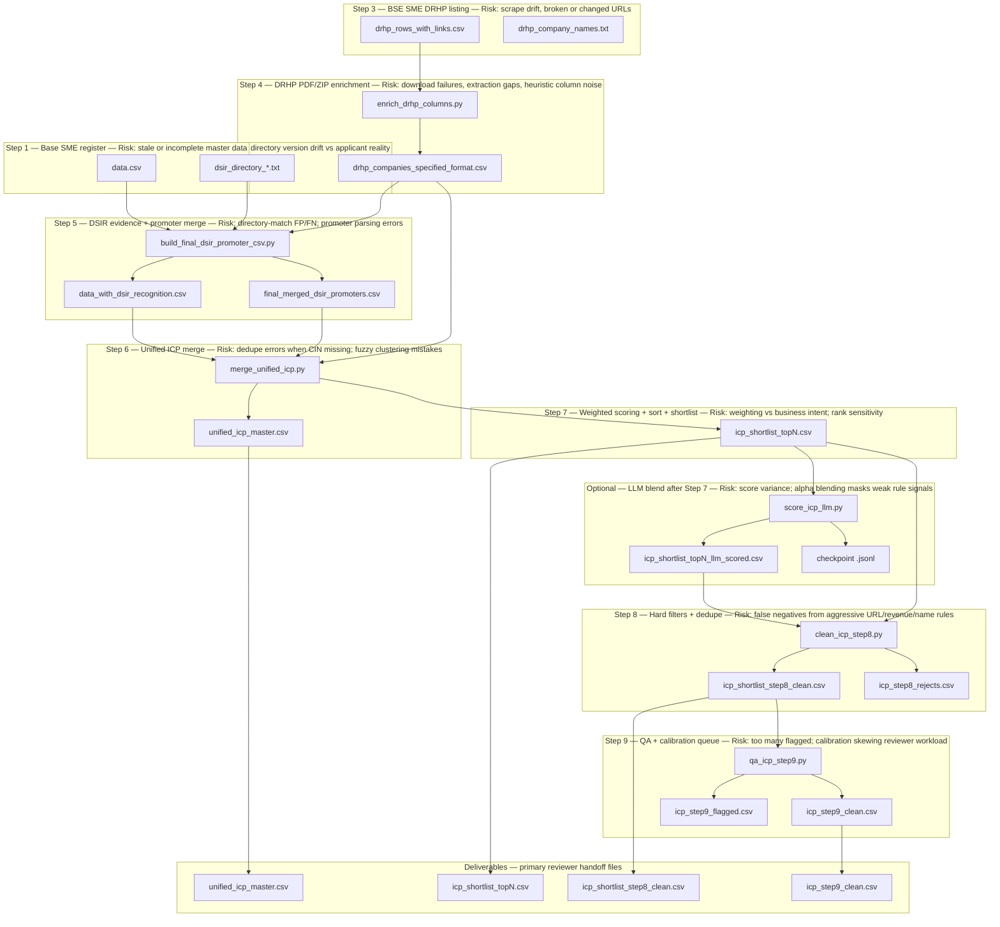

# ICP pipeline roadmap (Steps 1–9)

Reviewer-oriented flow: each stage is labeled **Step *n*** with the main **risk** called out. Optional **LLM blend** sits after Step 7 when API access is available.

## Deliverables (summary)

| File | Produced after |
|------|----------------|
| `unified_icp_master.csv` | Step 6 (same script run as Step 7; single logical artefact for the merged schema) |
| `icp_shortlist_topN.csv` | Step 7 (`merge_unified_icp.py`, `--top-n`; e.g. `icp_shortlist_top1000.csv`) |
| `icp_shortlist_step8_clean.csv` | Step 8 |
| `icp_step9_clean.csv` | Step 9 |

Supporting artefacts not listed above include rejects (`icp_step8_rejects.csv`), QA-flagged rows (`icp_step9_flagged.csv`), summaries (`icp_step8_summary.txt`, `icp_step9_summary.txt`), and optional LLM checkpoint/scored CSVs.

## Notes

- **Steps 6–7** are implemented together in `merge_unified_icp.py`; the diagram separates them so reviewers map roadmap steps to scoring behaviour (dedupe/normalized schema vs weighted rank + shortlist).
- **`--rules-only`** on `score_icp_llm.py` skips LLM calls; Step 8 can consume the Step 7 shortlist directly.
